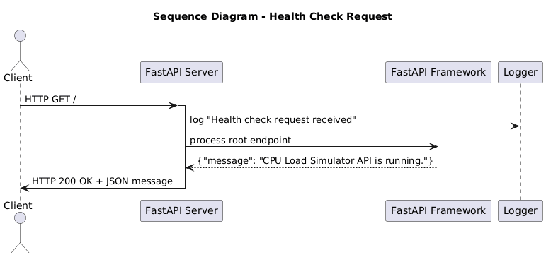
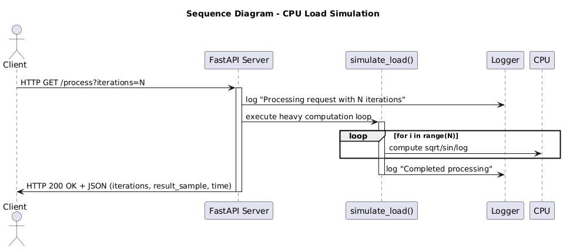

# FastAPI Load Simulator

This is an academic project for the Master's program at TUS Midlands.  
For educational purposes and academic collaboration.

## License

Academic Project - TUS Midlands 2025

## Student Information

Name: Weverton de Souza Castanho  
Program: Master of Science in Software Design with Cloud Native Computing  
Course: Container Design and Deployment (AL_KCNCM_9_1) 29433  
Institution: TUS - Technological University of the Shannon: Midlands Midwest  
Year: 2025  

---

## 1. Project Description

A simple FastAPI-based web service that simulates CPU load by performing mathematical operations.  
A Python client is included to test the processing endpoint and measure execution time.  
The project is designed for demonstration and deployment in container environments.

---

## 2. Requirements

- Python 3.9 or higher  
- pip (Python package installer)  
- Docker and Docker Compose (optional, for container deployment)

All dependencies required to run the application are listed in `requirements.txt`.

### requirements.txt
```bash
pip install -r requirements.txt
```


